# Diabetes ML Service - Learning Journey

## Project Overview
This project is my learning journey as a junior AI engineer to understand key concepts in machine learning, containerization, and concurrent programming. I built a machine learning service that trains multiple diabetes prediction models and serves them through a web API, all containerized with Docker.

**What this project does:** 
- Trains 10 different machine learning models on the diabetes dataset using scikit-learn
- Uses multiprocessing to train models in parallel for faster training
- Uses threading to handle multiple API requests at the same time  
- Creates visualizations with matplotlib to understand model performance
- Packages everything in a Docker container that can run anywhere
- Provides a REST API to start training jobs, check status, and get results

## Learning Goals Achieved

This project helped me achieve 5 key learning goals:

1. **Create and run a simple Docker container** 
2. **Familiarize with Matplotlib and Scikit-learn** 
3. **Learn to train simple models using Scikit-learn** 
4. **Understand multiprocessing and threading** 
5. **Learn to containerize a Python backend using Docker**

---

## Goal 1: Create and Run a Simple Docker Container

**What I learned:** Docker is like a shipping container for code. It packages my application with all its dependencies so it runs the same way on any machine.

### Key Docker Concepts I Applied:

**Dockerfile Structure:**
```dockerfile
# Start from a base image that already has Python installed
FROM python:3.12

# Set working directory inside container
WORKDIR /app

# Install system dependencies for matplotlib
RUN apt-get update && apt-get install -y --no-install-recommends \
    libfreetype6 \
    libpng16-16 \
  && rm -rf /var/lib/apt/lists/*

# Copy and install Python dependencies
COPY requirements.txt .
RUN pip install --no-cache-dir -r requirements.txt

# Copy my entire project into the container
COPY . .

# Tell Docker which port my app uses
EXPOSE 8000

# Command to run when container starts
CMD ["uvicorn", "src.main:app", "--host", "0.0.0.0", "--port", "8000"]
```

**What each part does:**
- `FROM python:3.12`: Start with a machine that already has Python 3.12
- `WORKDIR /app`: Inside container, work in the `/app` folder
- `RUN apt-get...`: Install system libraries that matplotlib needs to create plots
- `COPY requirements.txt .`: Copy my Python dependency list into container
- `RUN pip install...`: Install all Python packages my app needs
- `COPY . .`: Copy all my code files into the container
- `EXPOSE 8000`: Tell Docker my app listens on port 8000
- `CMD`: When someone runs this container, start my FastAPI server

**Docker Commands I Use:**
```bash
# Build the image (like creating a template)
docker build -t diabetes-ml-service .

# Run the container (create and start instance from template)
docker run -p 8000:8000 diabetes-ml-service

# The -p 8000:8000 means: 
# Connect port 8000 on my laptop to port 8000 inside container
```

## Docker Desktop: Layers + Vulnerabilities

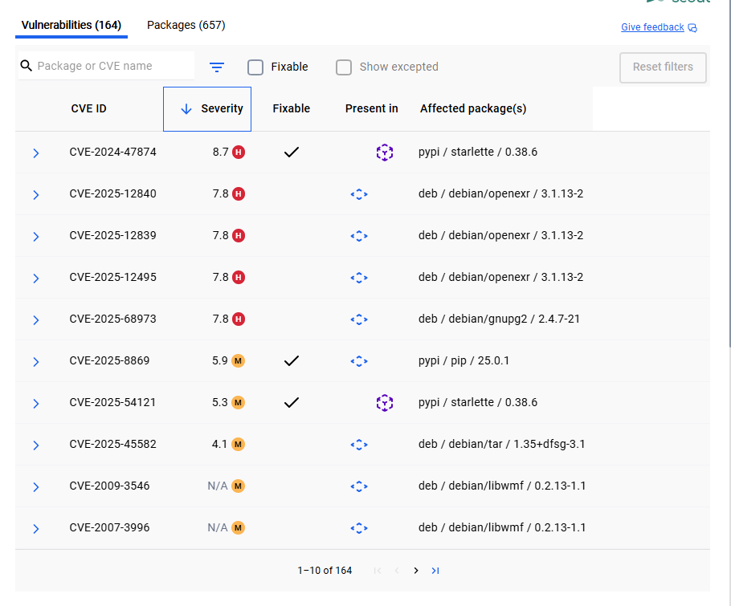
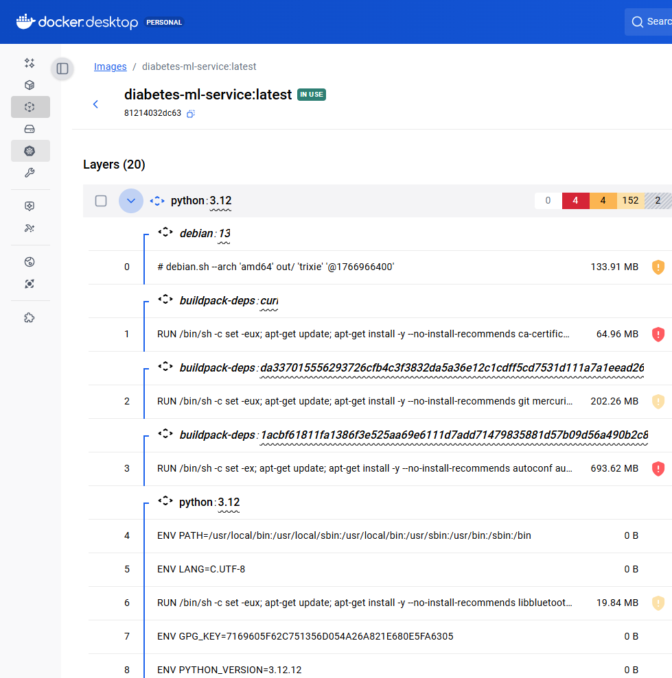
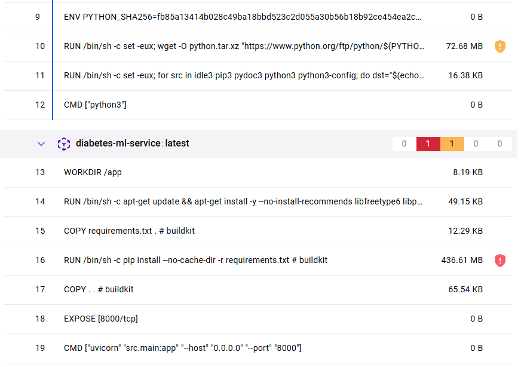

**Image Information:**
- My image `diabetes-ml-service:latest` shows as "IN USE" when a container is running from it
- The image size is about 2.16 GB (this includes Python, all my libraries, and my code)
- Docker Desktop shows me all the "layers" that make up my image

**Docker Layers:**
Docker images are built as a **stack of immutable layers**. Each `Dockerfile` step typically creates a layer:
- Bottom layers: Come from the base Python 3.12 image (includes Linux OS and Python)
- My layers: Created by my Dockerfile commands
  - Setting working directory
  - Installing matplotlib system libraries  
  - Installing Python packages (this layer is biggest because scikit-learn is large)
  - Copying my application code

**Security Scanning:**
Docker Desktop has a "vulnerabilities" tab that checks for security issues in my image:
- It finds known security problems in the base image and Python packages
- Most issues come from the Linux system packages (not my code)
- "Fixable" means there's a newer version available to fix the issue
- This helps me keep my container secure by updating dependencies regularly


**Docker Desktop Container**

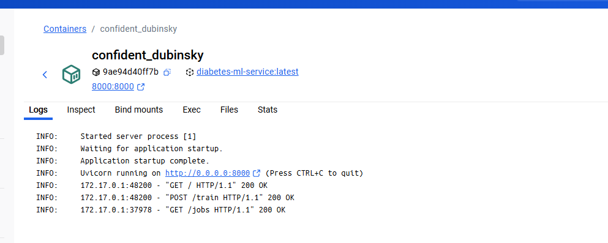
---

## Goal 2: Familiarize with Matplotlib and Scikit-learn

Matplotlib creates visualizations and scikit-learn provides machine learning algorithms. Together they help me understand how well my models work.

### Matplotlib Implementation

**File:** [src/plots.py](src/plots.py)

I created two types of plots to understand model performance:

**1. Predicted vs True Plot:**
```python
def plot_pred_vs_true_png(y_true, y_pred) -> bytes:
    y_true = _to_np(y_true)
    y_pred = _to_np(y_pred)

    fig = plt.figure()
    ax = fig.add_subplot(111)

    # Scatter plot: each dot is one prediction
    ax.scatter(y_true, y_pred)
    
    # Perfect prediction line (where predicted = true)
    min_v = float(min(y_true.min(), y_pred.min()))
    max_v = float(max(y_true.max(), y_pred.max()))
    ax.plot([min_v, max_v], [min_v, max_v])

    ax.set_title("Predicted vs True (Diabetes)")
    ax.set_xlabel("True")
    ax.set_ylabel("Predicted")

    # Convert plot to PNG bytes for web API
    buf = BytesIO()
    fig.tight_layout()
    fig.savefig(buf, format="png", dpi=150)
    plt.close(fig)
    return buf.getvalue()
```

**What this plot shows me:**
- If dots are close to the diagonal line = good predictions
- If dots are scattered far from line = poor predictions  
- Perfect model would have all dots exactly on the line

**2. Residuals Histogram:**
```python
def plot_residuals_png(y_true, y_pred) -> bytes:
    y_true = _to_np(y_true)
    y_pred = _to_np(y_pred)
    residuals = y_true - y_pred  # How much we were wrong by

    fig = plt.figure()
    ax = fig.add_subplot(111)

    ax.hist(residuals, bins=30)
    ax.set_title("Residuals Histogram (True - Predicted)")
    ax.set_xlabel("Residual")
    ax.set_ylabel("Count")
```

**What this plot shows me:**
- Residual = true value - predicted value (how wrong we were)
- Good model: histogram centered around 0 (not biased)
- Bad model: histogram shifted left or right (consistently over/under predicting)

**Key Matplotlib concepts:**
- `matplotlib.use("Agg")`: Use non-interactive backend for Docker/servers
- `plt.figure()`: Create new plot canvas
- `ax.scatter()`: Make scatter plot (dots)
- `ax.plot()`: Make line plot  
- `ax.hist()`: Make histogram
- `BytesIO()`: Convert plot to bytes to send through web API
- `fig.savefig()`: Save plot as PNG image
- `plt.close()`: Free memory after creating plot

### Scikit-learn Implementation

**File:** [../src/training.py](src/training.py)

I implemented 10 different machine learning algorithms to understand different approaches:

**Model Categories:**

**1. Linear Models** (assume straight-line relationships):
```python
# Basic linear regression - fits best straight line
LinearRegression()

# Ridge regression - linear + penalty for large weights (prevents overfitting) 
Ridge(alpha=1.0, random_state=random_state)

# Lasso regression - can set some weights to exactly 0 (feature selection)
Lasso(alpha=0.001, max_iter=10_000)

# Elastic Net - combines Ridge and Lasso penalties
ElasticNet(alpha=0.001, l1_ratio=0.5, max_iter=10_000)
```

**2. Tree-Based Models** (make decisions like flowcharts):
```python
# Random Forest - builds many decision trees, averages results
RandomForestRegressor(n_estimators=300, random_state=random_state, n_jobs=1)

# Extra Trees - even more random than Random Forest
ExtraTreesRegressor(n_estimators=500, random_state=random_state, n_jobs=1)

# Gradient Boosting - builds trees sequentially, each fixes previous errors
GradientBoostingRegressor(learning_rate=0.05, n_estimators=200, random_state=random_state)

# Histogram Gradient Boosting - faster version of gradient boosting
HistGradientBoostingRegressor(learning_rate=0.05, max_iter=200, random_state=random_state)
```

**3. Distance-Based Models** (use similarity between data points):
```python
# K-Nearest Neighbors - predicts by averaging nearest similar points
Pipeline([
    ("scaler", StandardScaler()),  # Make all features same scale
    ("knn", KNeighborsRegressor(n_neighbors=7))
])

# Support Vector Regression - fits function with margin of tolerance  
Pipeline([
    ("scaler", StandardScaler()),  # SVR needs scaled features
    ("svr", SVR(kernel="rbf", C=10.0, gamma="scale"))
])
```

**Key Scikit-learn concepts:**
- `train_test_split()`: Divide data into training and testing parts
- `fit()`: Train the model on training data
- `predict()`: Use trained model to make predictions on new data
- `Pipeline()`: Chain together data preprocessing and model training
- `StandardScaler()`: Make all features have mean=0 and std=1 (important for distance-based models)
- Model evaluation metrics: R² (higher=better), RMSE (lower=better), MAE (lower=better)

---

## Goal 3: Learn to Train Simple Models Using Scikit-learn

Machine learning training is about finding patterns in data. I split data into training (to learn) and testing (to evaluate), then measure how well each algorithm performs.

### Training Process Implementation

**File:** [src/training.py](src/training.py) - Function `_train_one_model()`

**Step 1: Load Dataset**
```python
# Load the diabetes dataset - 442 samples, 10 features each
X, y = load_diabetes(return_X_y=True)
```
**What this dataset contains:**
- X = 10 features (age, sex, BMI, blood pressure, etc.)
- y = diabetes progression score (target to predict)
- 442 patients total

**Step 2: Split Data**
```python
# Split into 80% training, 20% testing
X_train, X_test, y_train, y_test = train_test_split(
    X, y, test_size=test_size, random_state=random_state
)
```
**Why split data:**
- Training set: Model learns patterns from this data
- Test set: Evaluate how well model works on unseen data
- Never let model see test data during training (that would be cheating!)

**Step 3: Create and Train Model**
```python
# Create specific model (e.g., RandomForest, LinearRegression)
model = _make_model(model_name, random_state=random_state)

# Train the model - it learns patterns from training data
model.fit(X_train, y_train)
```

**Step 4: Make Predictions**
```python
# Use trained model to predict on test data
y_pred = model.predict(X_test)
```

**Step 5: Evaluate Performance**
```python
def _compute_metrics(y_true: np.ndarray, y_pred: np.ndarray) -> dict[str, float]:
    mse = mean_squared_error(y_true, y_pred)
    rmse = float(np.sqrt(mse))  # Root Mean Squared Error
    mae = float(mean_absolute_error(y_true, y_pred))  # Mean Absolute Error  
    r2 = float(r2_score(y_true, y_pred))  # R-squared score
    return {"rmse": rmse, "mae": mae, "r2": r2}
```

**What these metrics mean:**
- **RMSE (Root Mean Squared Error)**: Average prediction error, punishes big mistakes more
- **MAE (Mean Absolute Error)**: Average prediction error, treats all mistakes equally  
- **R² (R-squared)**: How much variance model explains (1.0 = perfect, 0.0 = random guessing)

**Step 6: Save Trained Model**
```python
# Save model to disk so we can use it later
model_path = Path(model_dir) / f"{job_id}__{model_name}.joblib"
joblib.dump(model, model_path)
```

### Model Selection Logic
```python
# Find best model based on highest R² score
best = max(results, key=lambda r: r["metrics"]["r2"])
```
**Why use R²:** Higher R² means model explains more of the data variation, so it's making better predictions.

---

## Goal 4: Understand Multiprocessing and Threading

Python can do multiple things at the same time using threads (for I/O tasks) and processes (for CPU-heavy tasks). This makes my application faster and more responsive.

### Threading Implementation

**File:** [src/main.py](src/main.py)

**Thread Pool for API Requests:**
```python
# Create pool of 2 threads for handling training requests
TRAIN_EXECUTOR = ThreadPoolExecutor(max_workers=2)

# Thread-safe lock to protect shared data
JOBS_LOCK = Lock()
JOBS: dict[str, dict[str, Any]] = {}  # Shared memory between threads
```

**How threading works in my API:**
```python
@app.post("/train")
def train(req: TrainRequest):
    # Create unique job ID
    job_id = str(uuid4())
    
    # Safely add job to shared memory
    with JOBS_LOCK:
        JOBS[job_id] = {
            "job_id": job_id,
            "status": "queued",
            "created_at": datetime.now(timezone.utc).isoformat(),
        }
    
    # Submit job to thread pool - doesn't block API
    TRAIN_EXECUTOR.submit(_run_training_job, job_id, req)
    return {"job_id": job_id, "status": "queued"}
```

- FastAPI can keep accepting new requests while training runs in background
- Multiple users can start training jobs simultaneously
- Main thread stays responsive for status checks and results retrieval

**Thread Safety with Locks:**
```python
def _set_job(job_id: str, patch: dict[str, Any]) -> None:
    with JOBS_LOCK:  # Only one thread can modify JOBS at a time
        JOBS[job_id].update(patch)
```
**Why locks are needed:** Without locks, if two threads modify JOBS simultaneously, data could get corrupted.

### Multiprocessing Implementation  

**File:** [src/training.py](src/training.py) - Function `train_models_in_parallel()`

**Process Pool for CPU-Heavy Training:**
```python
def train_models_in_parallel(job_id: str, cfg: TrainConfig) -> dict[str, Any]:
    # Use at most 1 process per CPU core, but not more than number of models
    max_workers = min(len(cfg.model_names), os.cpu_count() or 1)
    
    results: list[dict[str, Any]] = []
    # Each model trains in separate process
    with ProcessPoolExecutor(max_workers=max_workers) as ex:
        futures = [
            ex.submit(
                _train_one_model,  # Function to run in separate process
                job_id,
                model_name, 
                str(model_dir),
                cfg.test_size,
                cfg.random_state,
            )
            for model_name in cfg.model_names
        ]
        
        # Collect results as processes complete
        for fut in as_completed(futures):
            results.append(fut.result())
    
    return results
```

**Why I use multiprocessing here:**
- Model training is CPU-intensive (lots of math calculations)
- Python's GIL (Global Interpreter Lock) prevents true parallelism with threads for CPU work
- Processes run on separate CPU cores, so training multiple models is much faster

**Key Concepts:**

**Threading vs Multiprocessing:**
- **Threads**: Good for I/O (file reading, network requests) - share memory
- **Processes**: Good for CPU work (math, training) - separate memory spaces
- **GIL**: Python limitation that prevents threads from using multiple CPU cores for CPU work

**Process Pool Benefits:**
- Automatically manages creating/destroying processes
- `as_completed()` returns results as soon as each process finishes
- Scales based on available CPU cores

**Example Execution Flow:**
1. API receives training request for 3 models
2. Thread pool submits job to background thread (API stays responsive)
3. Background thread creates process pool with up to 3 processes
4. Each process trains one model on separate CPU core
5. Results collected as processes complete
6. Best model selected and returned

---

## Goal 5: Learn to Containerize a Python Backend Using Docker

**What I learned:** Containerization packages my entire application with all dependencies so it runs identically on any machine. This solves the "it works on my machine" problem.

### Complete Containerization Strategy

**File:** [Dockerfile](Dockerfile)

**Multi-Stage Container Design:**

**Stage 1: Base Environment Setup**
```dockerfile
# Use official Python image with specific version
FROM python:3.12

# Set working directory inside container  
WORKDIR /app
```
**Why Python 3.12:** Specific version ensures consistent behavior across environments.

**Stage 2: System Dependencies**
```dockerfile
# Install matplotlib system dependencies
RUN apt-get update && apt-get install -y --no-install-recommends \
    libfreetype6 \     # Font rendering for plots
    libpng16-16 \      # PNG image support  
  && rm -rf /var/lib/apt/lists/*  # Clean up to reduce image size
```
**Why these libraries:** Matplotlib needs system-level graphics libraries to create plots in headless environment.

**Stage 3: Python Dependencies** 
```dockerfile
# Copy requirements first (for Docker layer caching)
COPY requirements.txt .

# Install Python packages
RUN pip install --no-cache-dir -r requirements.txt
```
**Docker Layer Caching:** By copying requirements.txt first, Docker can reuse this layer if only my code changes but dependencies stay same.

**Stage 4: Application Code**
```dockerfile
# Copy entire project (except .dockerignore files)
COPY . .

# Expose port that FastAPI uses
EXPOSE 8000

# Command to run when container starts
CMD ["uvicorn", "src.main:app", "--host", "0.0.0.0", "--port", "8000"]
```

**Key Containerization Concepts:**

**1. Port Mapping:**
```bash
docker run -p 8000:8000 diabetes-ml-service
```
- `-p 8000:8000`: Maps localhost port 8000 to container port 8000
- Without this, cannot access app from outside container

**2. Host Binding:**
```dockerfile
CMD ["uvicorn", "src.main:app", "--host", "0.0.0.0", "--port", "8000"]
```
- `--host 0.0.0.0`: Listen on all network interfaces (not just localhost)
- Required for Docker networking to work properly

**3. Headless Matplotlib:**
```python
matplotlib.use("Agg")  # Non-interactive backend
```
**In [src/plots.py](src/plots.py#L5):** Container has no display, so must use non-interactive backend.

**4. Environment Isolation:**
- Container has its own file system, network, processes
- Models saved to `/app/models/` inside container
- Complete isolation from host machine Python environment

Example of saved models in working directory:
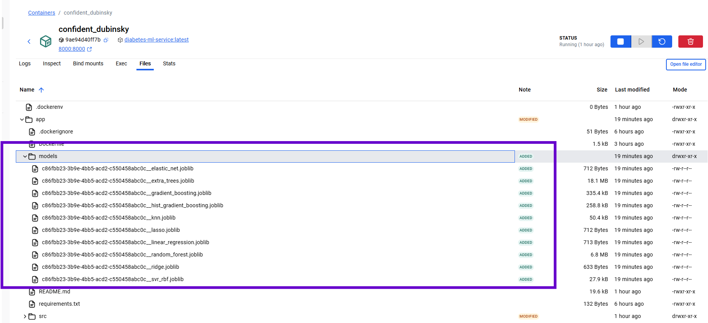

**Container Lifecycle I Implemented:**

**Build Phase:**
```bash
docker build -t diabetes-ml-service .
```
1. Downloads Python 3.12 base image
2. Installs system dependencies  
3. Installs Python packages
4. Copies application code
5. Sets default command

**Run Phase:**  
```bash
docker run -p 8000:8000 diabetes-ml-service
```
1. Creates new container from image
2. Starts FastAPI server inside container
3. Maps container port to host port
4. Application ready to accept requests

**Production Benefits:**
- Same environment on development laptop, test server, production
- Easy to deploy - just need Docker installed
- Scalable - can run multiple container instances  
- Isolated - dependencies don't conflict with host system

---

## API Endpoints and Usage

My containerized service provides a complete REST API for training models and getting results:

### 1. Root Endpoint - Health Check
**GET /** - Quick sanity check to see if service is running

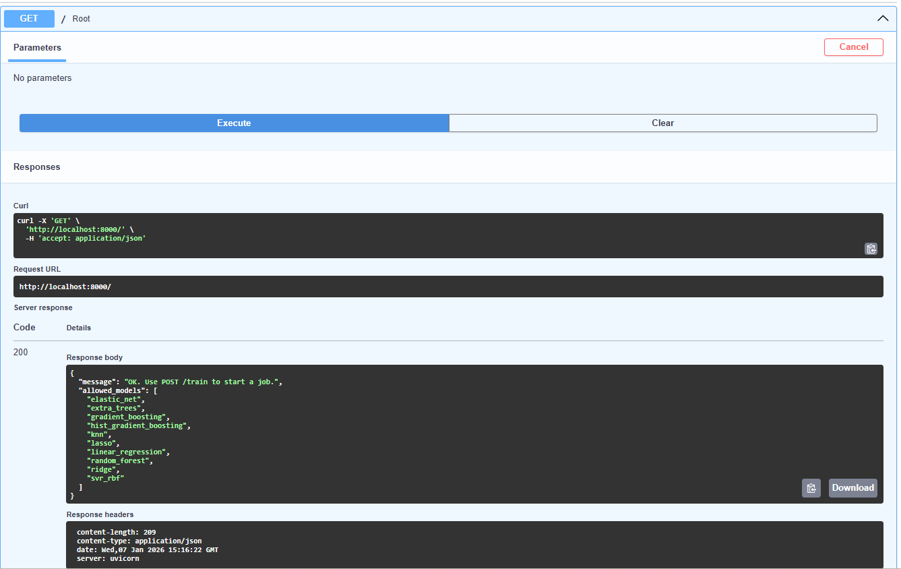

### 2. Start Training Job  
**POST /train** - Start a new model training job

**Request Body Example:**
```json
{
  "model_names": [
    "elastic_net",
    "extra_trees",
    "gradient_boosting",
    "hist_gradient_boosting",
    "knn",
    "lasso",
    "linear_regression",
    "random_forest",
    "ridge",
    "svr_rbf"
  ],
  "test_size": 0.2,
  "random_state": 4
}
```

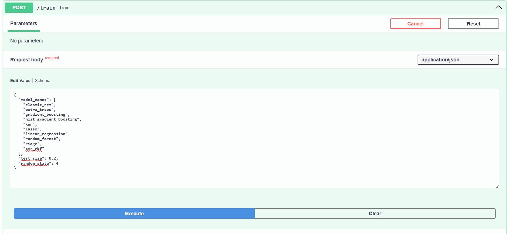
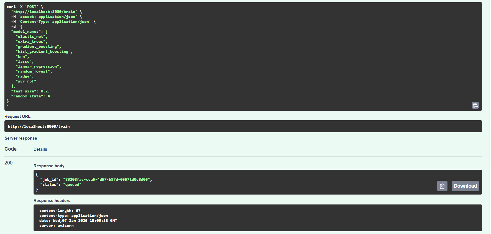

### 3. Check Job Status
**GET /status/{job_id}** - Check if training job is running, done, or failed

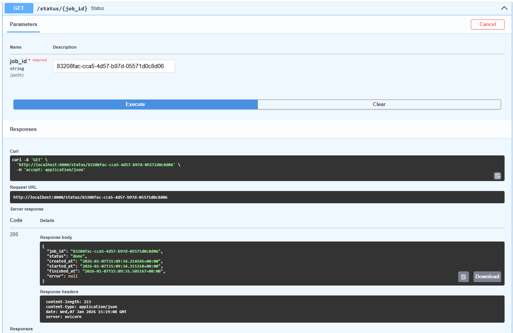

### 4. Get Training Results
**GET /results/{job_id}** - Get detailed results from completed training job

**What the results include:**
- Best model name and metrics (R², RMSE, MAE)
- All model results with their performance
- Model file paths where trained models are saved

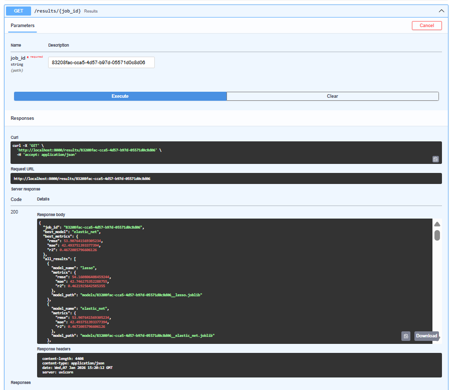

```json
{
  "job_id": "83208fac-cca5-4d57-b97d-05571d0c8d06",
  "best_model": "elastic_net",
  "best_metrics": {
    "rmse": 53.907641569305234,
    "mae": 42.493751393377394,
    "r2": 0.4672085796606126
  },
  "all_results": [
    {
      "model_name": "lasso",
      "metrics": {
        "rmse": 54.160806408459244,
        "mae": 42.746275352288755,
        "r2": 0.4621925642585355
      },
      "model_path": "models/83208fac-cca5-4d57-b97d-05571d0c8d06__lasso.joblib"
    },
    {
      "model_name": "elastic_net",
      "metrics": {
        "rmse": 53.907641569305234,
        "mae": 42.493751393377394,
        "r2": 0.4672085796606126
      },
      "model_path": "models/83208fac-cca5-4d57-b97d-05571d0c8d06__elastic_net.joblib"
    },
    {
      "model_name": "linear_regression",
      "metrics": {
        "rmse": 54.21584812943668,
        "mae": 42.78068694547004,
        "r2": 0.4610988992842088
      },
      "model_path": "models/83208fac-cca5-4d57-b97d-05571d0c8d06__linear_regression.joblib"
    },
    {
      "model_name": "knn",
      "metrics": {
        "rmse": 57.811233593905975,
        "mae": 43.31460674157303,
        "r2": 0.38725322852306276
      },
      "model_path": "models/83208fac-cca5-4d57-b97d-05571d0c8d06__knn.joblib"
    },
    {
      "model_name": "ridge",
      "metrics": {
        "rmse": 56.75744175877313,
        "mae": 45.66431720910487,
        "r2": 0.409388114012743
      },
      "model_path": "models/83208fac-cca5-4d57-b97d-05571d0c8d06__ridge.joblib"
    },
    {
      "model_name": "svr_rbf",
      "metrics": {
        "rmse": 56.59975047455458,
        "mae": 44.68187685468161,
        "r2": 0.412665392360977
      },
      "model_path": "models/83208fac-cca5-4d57-b97d-05571d0c8d06__svr_rbf.joblib"
    },
    {
      "model_name": "gradient_boosting",
      "metrics": {
        "rmse": 59.11068681713371,
        "mae": 46.11291609553581,
        "r2": 0.35939758800844246
      },
      "model_path": "models/83208fac-cca5-4d57-b97d-05571d0c8d06__gradient_boosting.joblib"
    },
    {
      "model_name": "hist_gradient_boosting",
      "metrics": {
        "rmse": 62.513231897065815,
        "mae": 48.434668814228324,
        "r2": 0.28352595378627354
      },
      "model_path": "models/83208fac-cca5-4d57-b97d-05571d0c8d06__hist_gradient_boosting.joblib"
    },
    {
      "model_name": "random_forest",
      "metrics": {
        "rmse": 57.61877096412011,
        "mae": 45.788352059925096,
        "r2": 0.391326296769161
      },
      "model_path": "models/83208fac-cca5-4d57-b97d-05571d0c8d06__random_forest.joblib"
    },
    {
      "model_name": "extra_trees",
      "metrics": {
        "rmse": 58.83462111735294,
        "mae": 44.36060674157304,
        "r2": 0.36536724911819396
      },
      "model_path": "models/83208fac-cca5-4d57-b97d-05571d0c8d06__extra_trees.joblib"
    }
  ],
  "best_y_test": [
    128,
    69,
    174,
    72,
    167,
    302,
    160,
    178,
    51,
    77,
    65,
    137,
    143,
    139,
    209,
    115,
    84,
    64,
    118,
    217,
    295,
    164,
    57,
    208,
    70,
    142,
    196,
    66,
    83,
    138,
    233,
    64,
    346,
    178,
    63,
    144,
    91,
    198,
    150,
    73,
    222,
    235,
    258,
    134,
    236,
    111,
    168,
    78,
    293,
    172,
    71,
    94,
    262,
    99,
    65,
    232,
    125,
    101,
    202,
    237,
    74,
    128,
    128,
    336,
    87,
    122,
    65,
    292,
    248,
    48,
    95,
    184,
    185,
    192,
    206,
    268,
    118,
    139,
    202,
    141,
    200,
    265,
    172,
    202,
    52,
    70,
    232,
    150,
    93
  ],
  "best_y_pred": [
    82.03203667182446,
    114.42162561828889,
    167.49522583470758,
    58.01233992635267,
    174.78332295264266,
    142.60817196311814,
    116.21688996879186,
    120.67069051794381,
    82.13630060139369,
    79.90208267112382,
    100.25370167398239,
    185.7357144422242,
    175.56500380815567,
    132.4525857989013,
    158.52469307195847,
    142.7508029287981,
    182.22258857859188,
    122.51557707358428,
    109.34083404851495,
    178.93147820617367,
    215.19755858039844,
    177.19042849496287,
    59.46042709273809,
    217.61394223622386,
    67.80349692911155,
    102.49734574840105,
    157.09925727925096,
    171.72938838983595,
    75.79875916209086,
    83.0074050196468,
    188.65820088263231,
    112.38601300275292,
    239.81095080706237,
    180.32036944732184,
    104.72570736157783,
    167.05134488666454,
    171.4562158099375,
    161.6677265865018,
    145.7752120586715,
    155.1593656166366,
    192.65140683290196,
    170.55226679623732,
    230.6847260249528,
    78.0099989696578,
    227.53624132556848,
    107.44604034405529,
    152.62609286299482,
    74.29364670216901,
    189.73953096678838,
    137.58171337677535,
    114.82298140519029,
    106.19028330221481,
    156.02903342687304,
    210.61833824683345,
    64.58229010316748,
    185.4480514001889,
    101.937425004078,
    94.48094691213174,
    180.7151289411573,
    214.56638705240084,
    127.48728503660641,
    104.74341777699223,
    164.87013669513547,
    236.50271571241842,
    110.03914708042826,
    168.49431351292924,
    131.19193800535783,
    195.90121897978344,
    217.77008397522178,
    182.57950560755984,
    147.65261306676743,
    155.06593185989396,
    157.73755329739703,
    212.0082623808092,
    160.99129515561185,
    201.88221013193385,
    107.00773440095819,
    182.7405382285836,
    139.46095405246908,
    157.24608386860885,
    152.15138597357932,
    189.49016602124937,
    152.54474092822682,
    151.5627990265827,
    74.39109462955723,
    173.32197367517108,
    213.69620581926642,
    114.40137820694142,
    137.30103400407606
  ],
  "best_model_path": "models/83208fac-cca5-4d57-b97d-05571d0c8d06__elastic_net.joblib"
}
```

### 5. Get Prediction Visualization  
**GET /plot/{job_id}/pred-vs-true** - Download scatter plot comparing predictions to true values

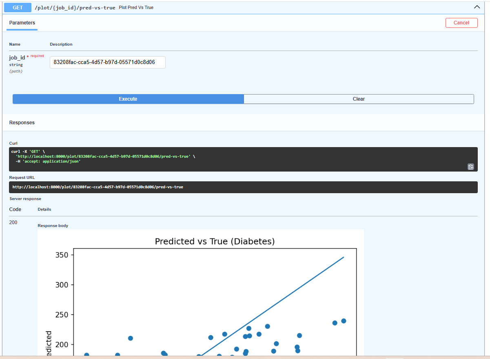
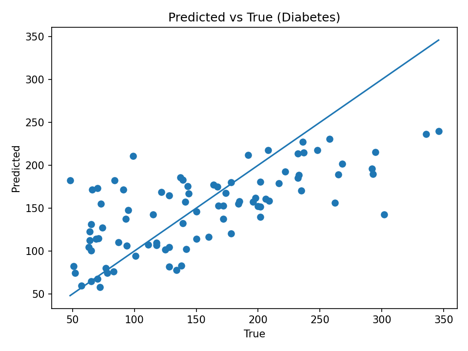

### 6. Get Residuals Visualization
**GET /plot/{job_id}/residuals** - Download histogram showing prediction errors

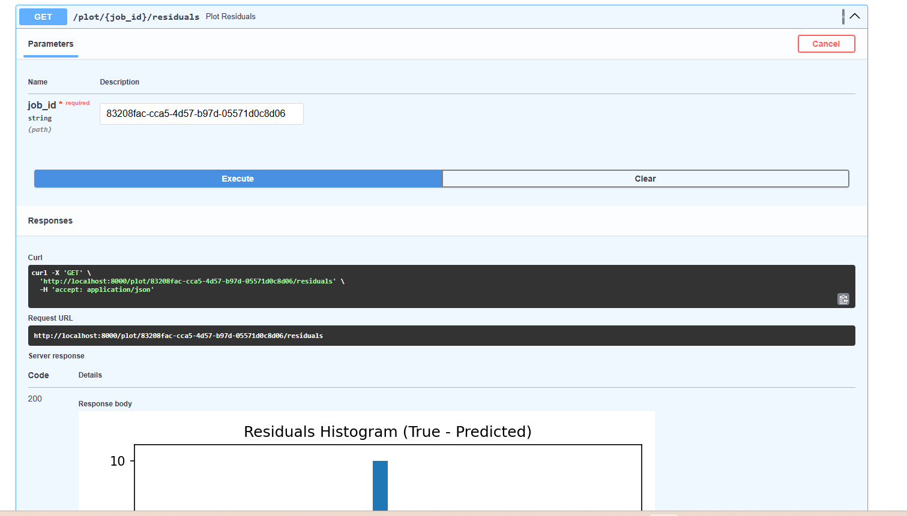
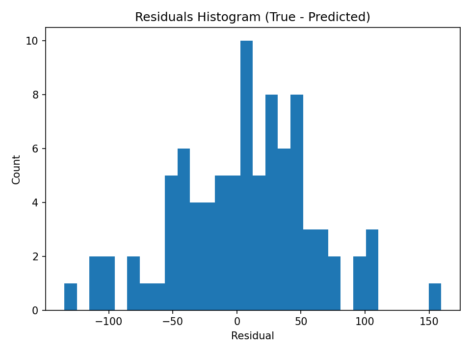

### 7. List All Jobs
**GET /jobs** - See all training jobs with their status and basic info

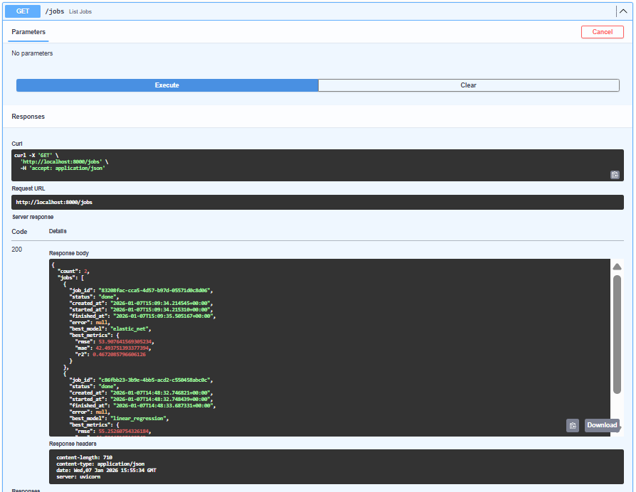

**GET /jobs** - Response Example
```json
{
  "count": 6,
  "jobs": [
    {
      "job_id": "962d723b-e178-4770-9038-2aa5bdc747d3",
      "status": "done",
      "created_at": "2026-01-07T16:01:05.473955+00:00",
      "started_at": "2026-01-07T16:01:05.474228+00:00",
      "finished_at": "2026-01-07T16:01:06.601254+00:00",
      "error": null,
      "best_model": "lasso",
      "best_metrics": {
        "rmse": 49.888784172637244,
        "mae": 40.617515649040854,
        "r2": 0.5333734997511699
      }
    },
    {
      "job_id": "33190c1e-9acb-4fd8-bafb-e4713b101a00",
      "status": "done",
      "created_at": "2026-01-07T16:01:01.286479+00:00",
      "started_at": "2026-01-07T16:01:01.286898+00:00",
      "finished_at": "2026-01-07T16:01:02.422735+00:00",
      "error": null,
      "best_model": "elastic_net",
      "best_metrics": {
        "rmse": 53.61117948988901,
        "mae": 43.42583216989436,
        "r2": 0.47330801187087856
      }
    },
    {
      "job_id": "a91d21e1-5afb-4279-a2c7-00265fc52583",
      "status": "done",
      "created_at": "2026-01-07T16:00:01.823125+00:00",
      "started_at": "2026-01-07T16:00:01.823377+00:00",
      "finished_at": "2026-01-07T16:00:02.657939+00:00",
      "error": null,
      "best_model": "extra_trees",
      "best_metrics": {
        "rmse": 55.4854804856352,
        "mae": 45.78207518796992,
        "r2": 0.5275534477454239
      }
    },
    {
      "job_id": "d15be772-ad34-4dd9-b368-9badfb02a65c",
      "status": "done",
      "created_at": "2026-01-07T15:59:58.196212+00:00",
      "started_at": "2026-01-07T15:59:58.196833+00:00",
      "finished_at": "2026-01-07T15:59:59.215034+00:00",
      "error": null,
      "best_model": "elastic_net",
      "best_metrics": {
        "rmse": 54.36390846041645,
        "mae": 43.658971806542304,
        "r2": 0.44787795673653596
      }
    },
    {
      "job_id": "cf726e84-3fb4-4fdb-ab4f-d0f6f15ac8a7",
      "status": "done",
      "created_at": "2026-01-07T15:59:57.666390+00:00",
      "started_at": "2026-01-07T15:59:57.666627+00:00",
      "finished_at": "2026-01-07T15:59:58.829181+00:00",
      "error": null,
      "best_model": "elastic_net",
      "best_metrics": {
        "rmse": 54.36390846041645,
        "mae": 43.658971806542304,
        "r2": 0.44787795673653596
      }
    },
    {
      "job_id": "7150c401-44d7-43dc-ac39-5076ceee7b64",
      "status": "done",
      "created_at": "2026-01-07T15:59:51.630487+00:00",
      "started_at": "2026-01-07T15:59:51.633157+00:00",
      "finished_at": "2026-01-07T15:59:52.717732+00:00",
      "error": null,
      "best_model": "elastic_net",
      "best_metrics": {
        "rmse": 53.907641569305234,
        "mae": 42.493751393377394,
        "r2": 0.4672085796606126
      }
    }
  ]
}
```

---

## Project Structure

```
├── Dockerfile              # Container configuration
├── requirements.txt        # Python dependencies  
├── src/
│   ├── main.py            # FastAPI web server + threading
│   ├── training.py        # ML models + multiprocessing  
│   └── plots.py           # Matplotlib visualizations
└── models/                # Saved trained models (.joblib files)
```

## Key Learning Outcomes

Through this project, I gained hands-on experience with:

1. **Docker containerization** - packaging applications with all dependencies
2. **Scikit-learn machine learning** - training and evaluating multiple model types
3. **Matplotlib data visualization** - creating plots to understand model performance  
4. **Python concurrency** - using threads for I/O and processes for CPU work
5. **FastAPI web development** - building REST APIs with async capabilities
6. **MLOps basics** - model training, saving, and serving pipeline


---

## Note: Local Development and Debugging

**For debugging purposes only**, if you need to run the service locally (outside Docker):

1. **Set up Python environment:**
   ```bash
   python -m venv .venv
   .venv\Scripts\activate  # Windows
   # or source .venv/bin/activate  # Linux/Mac
   pip install -r requirements.txt
   ```

2. **Run the service:**
   ```bash
   uvicorn src.main:app --reload --host 0.0.0.0 --port 8000
   ```

3. **Test endpoints with curl (local debugging only):**
   ```bash
   # Health check
   curl http://localhost:8000/
   
   # Start training
   curl -X POST http://localhost:8000/train \
     -H "Content-Type: application/json" \
     -d '{"model_names": ["linear_regression", "random_forest"]}'
   
   # Check status (replace job_id with actual ID)
   curl http://localhost:8000/status/{job_id}
   ```

**Important:** The production way to use this service is through the Docker container as shown in Goal 1.
